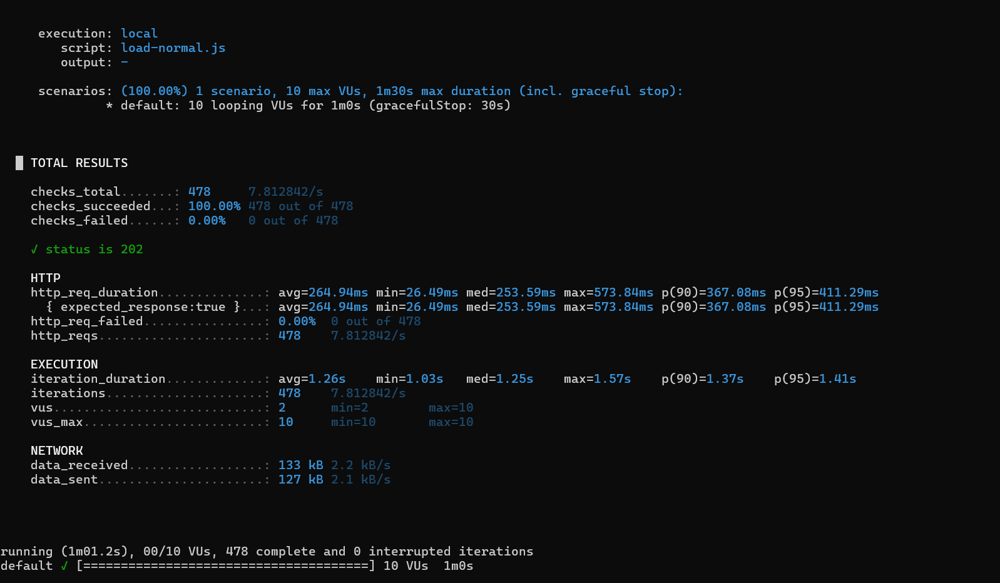
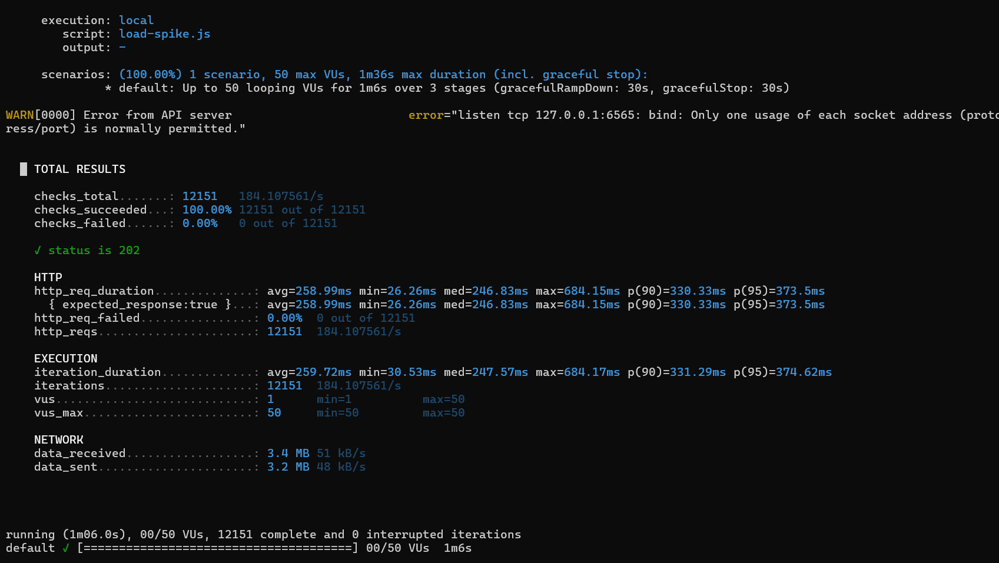

# Contact Form App (Next.js + AWS)

This is a simple contact form app I built to explore async processing using AWS.

Instead of sending emails directly from the API, the request is pushed to a queue and handled in the background.

---

## Live URL

http://contact-form-app-2-env.eba-pprh63cf.ap-south-1.elasticbeanstalk.com/

---

## How it works

Flow is pretty straightforward:

- User submits form  
- Next.js API pushes message to SQS  
- Lambda picks it up  
- Lambda sends email using SES  

This way the API stays fast even if email sending is slow.

---

## Tech used

- Next.js (frontend + API)  
- AWS SQS  
- AWS Lambda  
- AWS SES  
- Elastic Beanstalk (for hosting)  
- GitHub Actions (CI/CD)  
- AWS CDK (for infra)  

---

## Running locally

Clone the repo:

```bash
git clone https://github.com/NiloySarkar10/contact-form-app.git
cd contact-form-app

# Go to frontend:

```bash
cd frontend
npm install
```

Create a `.env.local` file:

```
AWS_REGION=ap-south-1
SQS_URL=<your-sqs-url>
```

Then run:

```bash
npm run dev
```

---

## Deployment

Deployment is handled via GitHub Actions. On every push to `main`:

- App gets built
- Deployed to Elastic Beanstalk
- Lambda gets updated
- CDK deploy runs (for infra)

---

## Load testing (k6)

I used k6 to test basic load scenarios.

### Normal load

- 10 users for 1 minute

### Spike test

- 50 users suddenly

### Output (sample)

```
TOTAL RESULTS

    checks_total.......: 478     7.812842/s
    checks_succeeded...: 100.00% 478 out of 478
    checks_failed......: 0.00%   0 out of 478

    ✓ status is 202

    HTTP
    http_req_duration..............: avg=264.94ms min=26.49ms med=253.59ms max=573.84ms p(90)=367.08ms p(95)=411.29ms
      { expected_response:true }...: avg=264.94ms min=26.49ms med=253.59ms max=573.84ms p(90)=367.08ms p(95)=411.29ms
    http_req_failed................: 0.00%  0 out of 478
    http_reqs......................: 478    7.812842/s

    EXECUTION
    iteration_duration.............: avg=1.26s    min=1.03s   med=1.25s    max=1.57s    p(90)=1.37s    p(95)=1.41s
    iterations.....................: 478    7.812842/s
    vus............................: 2      min=2        max=10
    vus_max........................: 10     min=10       max=10

    NETWORK
    data_received..................: 133 kB 2.2 kB/s
    data_sent......................: 127 kB 2.1 kB/s
```



During spike:

```

TOTAL RESULTS

    checks_total.......: 12151   184.107561/s
    checks_succeeded...: 100.00% 12151 out of 12151
    checks_failed......: 0.00%   0 out of 12151

    ✓ status is 202

    HTTP
    http_req_duration..............: avg=258.99ms min=26.26ms med=246.83ms max=684.15ms p(90)=330.33ms p(95)=373.5ms
      { expected_response:true }...: avg=258.99ms min=26.26ms med=246.83ms max=684.15ms p(90)=330.33ms p(95)=373.5ms
    http_req_failed................: 0.00%  0 out of 12151
    http_reqs......................: 12151  184.107561/s

    EXECUTION
    iteration_duration.............: avg=259.72ms min=30.53ms med=247.57ms max=684.17ms p(90)=331.29ms p(95)=374.62ms
    iterations.....................: 12151  184.107561/s
    vus............................: 1      min=1          max=50
    vus_max........................: 50     min=50         max=50

    NETWORK
    data_received..................: 3.4 MB 51 kB/s
    data_sent......................: 3.2 MB 48 kB/s

```


---

## What I learned

- How useful queues are for handling spikes
- Setting up CI/CD for full stack + infra
- Managing IAM permissions is tricky 😅
- CDK makes infra easier but bootstrap/setup can be confusing
- Debugging AWS services (Lambda, SES, SQS) takes time but gives good insight
- Load testing is more about observing system behavior than just response codes

---
